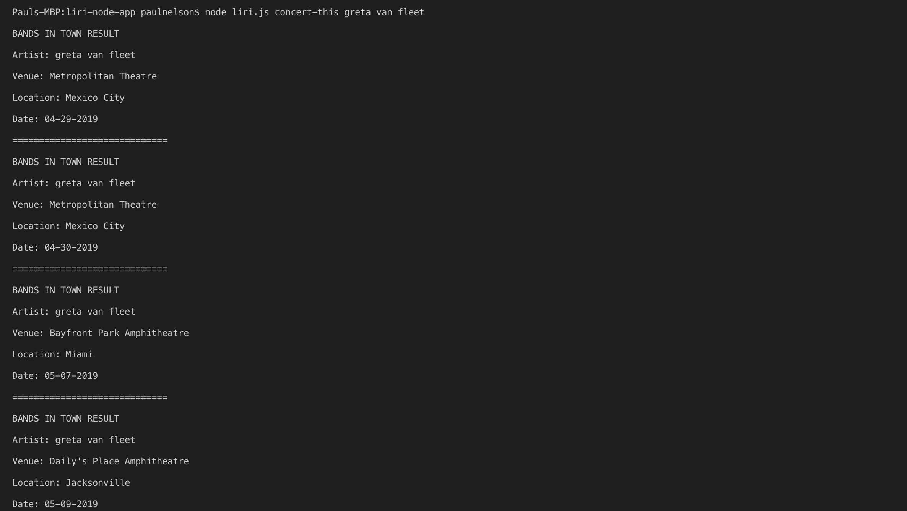
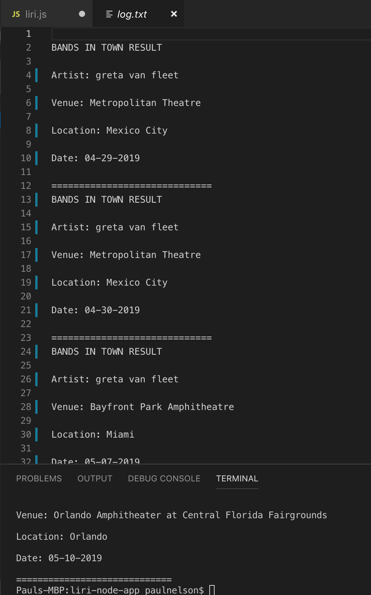
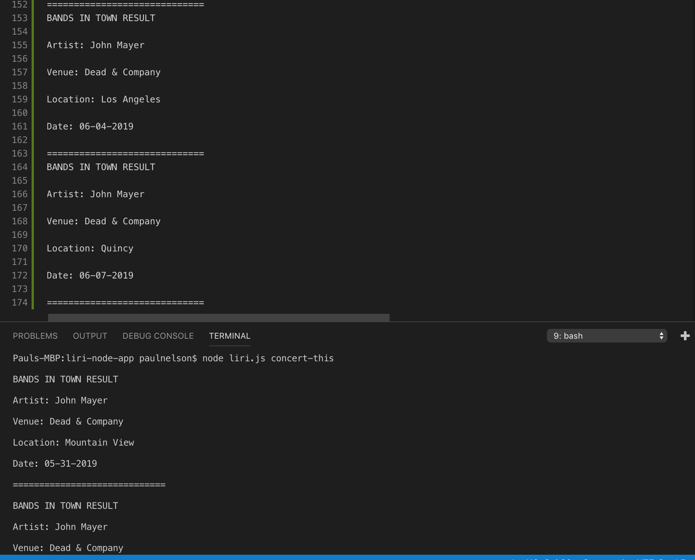
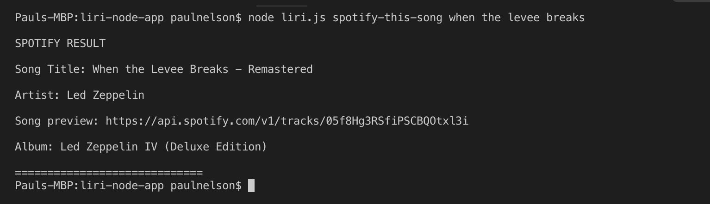
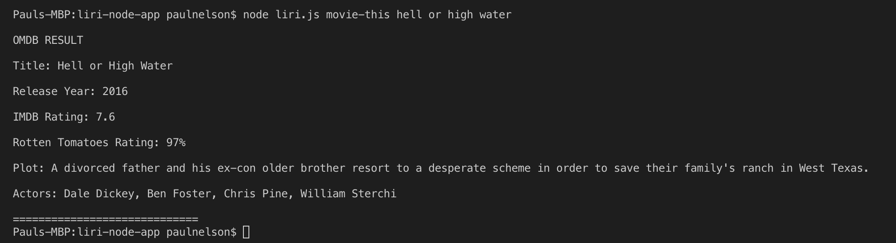
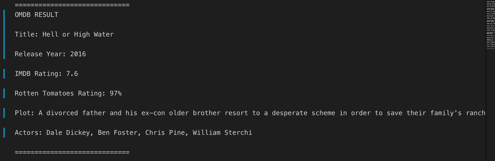
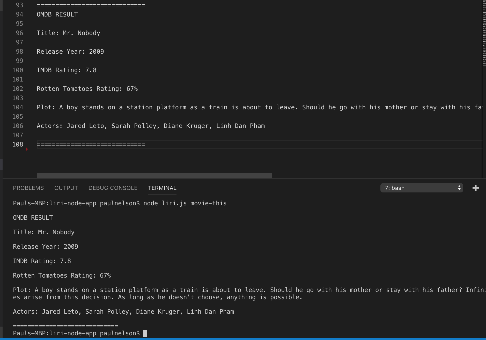
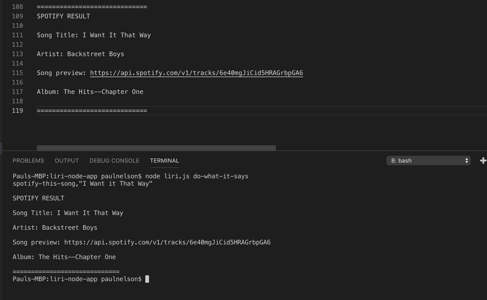

# liri-node-app

This application uses Node.js to create a bot that takes in arguments and returns data.

#### How To Use

In your command line, enter "node liri.js" followed by the command you want to perform and the parameter you would like to search for.

There are four commands to choose from:
* concert-this
* spotify-this-song
* movie-this
* do-what-it-says

## concert-this
This command uses axios to pull the next five shows from the Bands In Town API and displays them in the console as well as the log.txt file.  This information will include the artist, the venue, the city, and the date of each show.  If no artist is entered, the app will default to John Mayer.

* __Terminal:__ 

* __log.txt:__

* __Default:__

## spotify-this-song
This command pulls song information from the Spotify API and displays it in the console as well as the log.txt file.  This information will include the artist, the song name, a preview link of the song from Spotify, and the album the song is from.  If no song is entered for the search, the app will default to "The Sign" by Ace of Base. __NOTE:  YOU MUST HAVE A SPOTIFY STORED IN YOUR OWN .ENV FILE FOR THIS TO WORK.__

* __Terminal:__

* __log.txt:__

* __Default:__

## movie-this
This command uses axios to pull movie information from the OMDB API and displays it in the console as well as the log.txt file.  This information will include the title, year of release, IMDB rating, Rotten Tomatoes rating, Country the movie was produced, language of the movie, the plot, and the actors in the movie.  If no movie is entered for the search, the app will default to "Mr. Nobody"

* __Terminal:__

* __log.txt:__

* __Default:__

## do-what-it-says
This command pulls the information stored in the random.txt file and passes it through the app as a command and a search parameter. 

